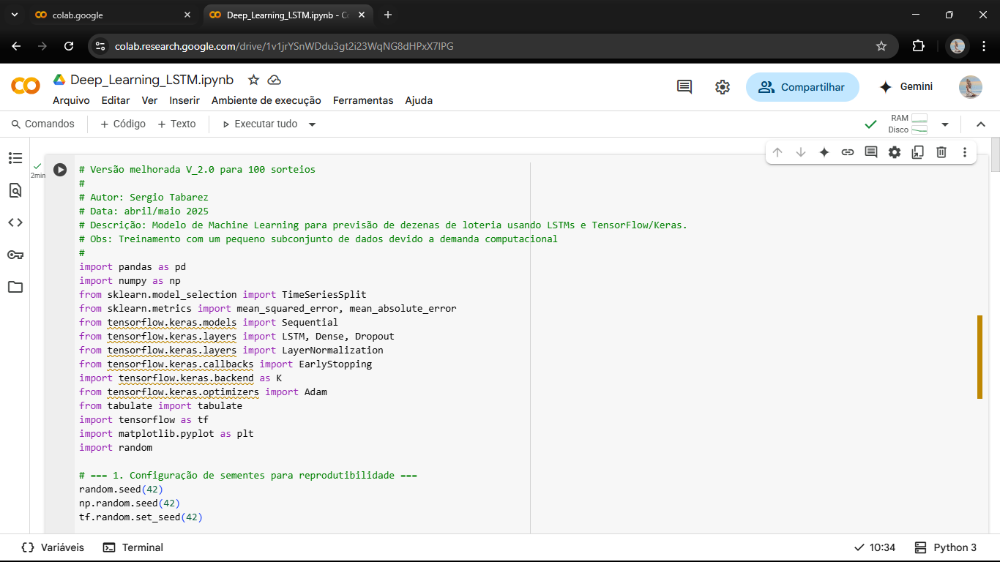

# Modelo de Previsão para Lotofácil com Deep Learning (LSTM)

Este projeto implementa um modelo de Machine Learning para prever números de sorteios da Lotofácil, utilizando redes neurais Long Short-Term Memory (LSTM). O objetivo é demonstrar a aplicação de Deep Learning em problemas de previsão de séries temporais.

## Tecnologias Utilizadas

* **Linguagem de Programação:** Python
* **Frameworks/Bibliotecas:**
    * TensorFlow
    * Keras
    * Pandas (para manipulação de dados)
    * NumPy (para operações numéricas)
    * Scikit-learn (para pré-processamento e métricas)
    * Matplotlib (para visualização)
    * Tabulate (para formatação de tabelas)

## Estrutura do Projeto

* `Deep_Learning_LSTM.ipynb`: O notebook principal contendo todo o código-fonte do modelo, treinamento, avaliação e simulações.
* `requirements.txt`: Lista das bibliotecas Python e suas versões necessárias para a execução do projeto.
* `Lotofacil-original100.xlsx`: Conjunto de dados de exemplo (subconjunto de 100 sorteios) utilizado para o treinamento e teste do modelo.
* `images/`: Pasta contendo gráficos de desempenho e capturas de tela do código/resultados.

## Como Executar o Projeto

Este projeto foi desenvolvido e otimizado para ser executado no [Google Colab](https://colab.research.google.com/) devido às suas dependências específicas e acesso a GPUs para treinamento eficiente.

1.  **Clone o Repositório** (ou baixe o ZIP):
    ```bash
    git clone [https://github.com/sergiotabarez/lottery-prediction-model.git](https://github.com/sergiotabarez/lottery-prediction-model.git)
    cd lottery-prediction-model
    ```

2.  **Abra o Notebook no Google Colab:**
    * Vá para [https://colab.research.google.com/](https://colab.research.google.com/)
    * Clique em `File` (Arquivo) > `Upload notebook` (Carregar notebook) e selecione o arquivo `Deep_Learning_LSTM.ipynb` que você baixou do repositório.
    * *(Alternativamente, se você já clonou o repositório para seu Google Drive ou localmente e quer abrir direto no Colab pelo GitHub, você pode ir em `File` > `Open notebook` > `GitHub` e colar o link direto para o seu notebook no GitHub: `https://github.com/sergiotabarez/lottery-prediction-model/blob/main/Deep_Learning_LSTM.ipynb`)*

3.  **Carregue o Arquivo de Dados (`Lotofacil-original100.xlsx`):**
    * No ambiente do Colab, utilize a opção de upload de arquivos (ícone de pasta na barra lateral esquerda).
    * Faça upload do arquivo `Lotofacil-original100.xlsx` para o ambiente de execução do Colab.
    * **Alternativamente, no próprio notebook, você pode incluir um código para montar o Google Drive e carregar o arquivo de lá, ou usar `files.upload()` do Colab Utilities.** *(Decida qual método de carregamento de dados você usou no seu notebook e instrua o usuário de acordo.)*

4.  **Instale as Dependências:**
    * Dentro do Colab, crie uma nova célula de código e execute o seguinte comando para instalar todas as bibliotecas necessárias:
        ```python
        !pip install -r requirements.txt
        ```

5.  **Execute a Célula**

## Resultados e Análise

* **Gráfico de Perda (Loss History):** Demonstra a convergência do modelo durante o treinamento.
     
    
* **Exemplo de Estrutura do Código:** Captura de tela de parte do código.
    

* **Exemplo de Resultados da Simulação:** Tabela com resultados da simulação de apostas.
    

## Observações e Próximos Passos

Este modelo demonstra a viabilidade do uso de redes LSTM para prever números da Lotofácil. Os resultados obtidos são promissores, mas é importante observar que o treinamento e os testes foram realizados com um subconjunto dos dados históricos dos sorteios (apenas 100).

Para obter o máximo desempenho e precisão, o ideal seria treinar o modelo com o conjunto completo de dados de todos os sorteios. No entanto, essa abordagem exigiria um poder computacional significativamente maior (mais tempo de processamento e possivelmente hardware mais potente).

Em trabalhos futuros, técnicas para lidar com essa demanda computacional poderão ser exploradas, como:
* Uso de GPUs mais robustas.
* Otimização de código para maior eficiência.
* Uso de técnicas de amostragem inteligente de dados históricos.
* Exploração de outras arquiteturas de Deep Learning ou Ensemble Learning.

## Autor

**Sergio Tabarez**

[www.linkedin.com/in/sergiotabarez]

[sergio.tabarez@gmail.com]

[https://github.com/sergiotabarez/lottery-prediction-model]

## Licença

Este projeto está licenciado sob a Licença MIT. Veja o arquivo [LICENSE](LICENSE) para mais detalhes.
